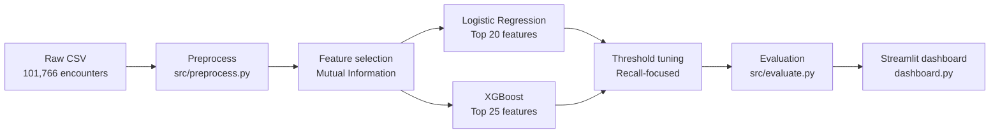

# Diabetes 30-Day Readmission Prediction

**MSBA-265 · University of the Pacific · Vishnu Vaibhav Binde**

Machine learning pipeline that predicts whether diabetic patients will be readmitted within 30 days of discharge, flags high-risk cases for early intervention, and ships with an interactive clinical dashboard.

[](https://www.python.org/downloads/)
[](https://scikit-learn.org/)
[](https://xgboost.readthedocs.io/)
[](https://streamlit.io/)

---

## Why this project

30-day hospital readmissions drive higher costs, worse outcomes, and CMS penalties under the Hospital Readmissions Reduction Program (HRRP). Diabetic patients are especially vulnerable because of medication complexity and comorbidities.

This project helps hospitals answer one question before discharge:

> **Which patients are most likely to come back within 30 days?**

High-risk patients can receive extra education, medication review, follow-up scheduling, and care coordination before they leave.

---

## Results at a glance

Evaluated on a held-out **20% test split** (~20K encounters) from the UCI Diabetes 130-US Hospitals dataset.

| Model | Features | Threshold | Recall | Precision | F1 | ROC-AUC |
|-------|----------|-----------|--------|-----------|-----|---------|
| Logistic Regression | Top 20 (MI) | 0.45 | ~67–70% | ~15% | ~0.24 | ~0.63 |
| **XGBoost (recommended)** | Top 25 (MI) | 0.10 | ~71% | ~17% | ~0.27 | ~0.68 |

**Deployment recommendation:** XGBoost — best balance of recall and overall discrimination while still supporting feature-importance views in the dashboard.

**Design priority:** High **recall** over precision. Missing a readmission (false negative) is clinically worse than flagging a patient who would not return (false positive).

---

## Quick start

**Requirements:** Python 3.8+, ~5–10 minutes on first run.

```bash
git clone https://github.com/bvishnu08/diabetes-readmission-prediction-with-flagging-hisk-risk-patiences-.git
cd diabetes-readmission-prediction-with-flagging-hisk-risk-patiences-
python run_all.py
```

`run_all.py` creates a virtual environment, installs dependencies, preprocesses data, trains both models, tunes decision thresholds, and prints evaluation metrics.

**Verify artifacts:**

```bash
python test_models.py
```

**Launch the dashboard:**

```bash
source .venv/bin/activate          # Mac/Linux
# .venv\Scripts\activate           # Windows
streamlit run dashboard.py         # → http://localhost:8501
```

No Git? Download the repo as a ZIP from GitHub and run the same commands inside the extracted folder. See [CLONE_AND_RUN_GUIDE.md](CLONE_AND_RUN_GUIDE.md) for step-by-step setup and troubleshooting.

---

## How it works



1. **Preprocess** — clean missing values, encode target (`<30` days → 1), stratified 80/20 split (seed 42)
2. **Select features** — Mutual Information ranks 41 candidate clinical/demographic variables
3. **Train** — sklearn pipelines with imputation + encoding; XGBoost uses gradient boosting
4. **Tune thresholds** — sweep 0.05–0.95; pick recall in 55–85% band with best F1
5. **Evaluate** — confusion matrix, ROC-AUC, and clinical risk summary via `clinical_utils.py`
6. **Deploy locally** — Streamlit dashboard for metrics, feature importance, and live predictions

---

## Repository layout

```
265_final/
├── run_all.py                 # One-command setup + train + evaluate
├── dashboard.py               # Streamlit clinical UI
├── src/                       # Core ML pipeline
│   ├── preprocess.py
│   ├── feature_selection.py
│   ├── model.py
│   ├── train.py
│   ├── evaluate.py
│   └── clinical_utils.py
├── scripts/                   # run_train.py, run_eval.py, run_dashboard.py
├── notebooks/                 # EDA, modeling, implementation walkthrough
├── data/raw/                  # diabetic_data.csv (UCI), IDS_mapping.csv
├── models/                    # Saved models + thresholds.json
├── docs/                      # Guides, slides, submission materials
└── reports/                   # P3 final report
```

Full map: [docs/PROJECT_STRUCTURE.md](docs/PROJECT_STRUCTURE.md)

---

## Data

| | |
|---|---|
| **Source** | [UCI ML Repository — Diabetes 130-US Hospitals (1999–2008)](https://archive.ics.uci.edu/ml/datasets/Diabetes+130-US+hospitals+for+years+1999-2008) |
| **Records** | 101,766 patient encounters across 130 US hospitals |
| **Target** | Binary: readmitted within 30 days vs not |
| **Features** | Demographics, utilization, diagnoses, labs, diabetes medications |

Raw data is included under `data/raw/` for reproducibility.

---

## Documentation

| Guide | Description |
|-------|-------------|
| [CLONE_AND_RUN_GUIDE.md](CLONE_AND_RUN_GUIDE.md) | Fresh clone setup, Windows fixes, troubleshooting |
| [PROJECT_EXPLANATION_GUIDE.md](PROJECT_EXPLANATION_GUIDE.md) | Module-by-module technical walkthrough |
| [docs/HOW_TO_VIEW_RESULTS.md](docs/HOW_TO_VIEW_RESULTS.md) | Reading metrics and dashboard output |
| [RESEARCH_PAPER.md](RESEARCH_PAPER.md) | Academic write-up |
| [reports/P3_FINAL_REPORT.md](reports/P3_FINAL_REPORT.md) | Course final report |

---

## Tech stack

`pandas` · `numpy` · `scikit-learn` · `xgboost` · `joblib` · `streamlit` · `matplotlib` · `seaborn` · `plotly`

Install manually: `pip install -r requirements.txt`

---

## Reproducibility

- Fixed random seed: **42** (split, training, feature selection)
- Saved artifacts: `models/logreg_selected.joblib`, `models/xgb_selected.joblib`, `models/thresholds.json`
- Processed data regenerated on each training run

---

## Author

**Vishnu Vaibhav Binde**  
MSBA-265, University of the Pacific

---

## Acknowledgments

Dataset: UCI Machine Learning Repository — *Diabetes 130-US hospitals for years 1999–2008*.  
Built for educational use as part of MSBA-265.
